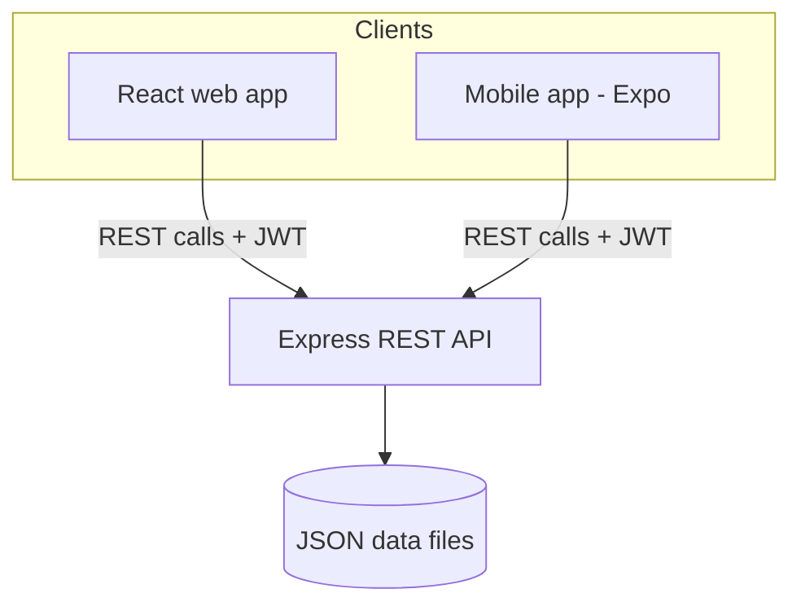
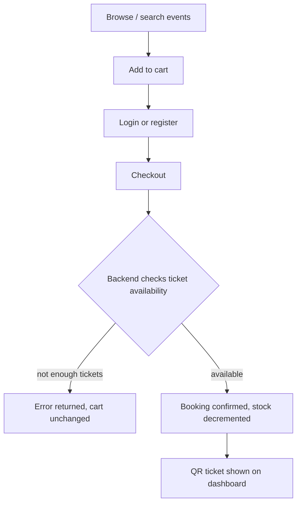

# 🎟️ Event Ticket Booking System

A full-stack event ticket booking platform with a **React web app**, a **React Native (Expo) mobile app**, and a shared **Node.js/Express REST API**. Users can browse events, add tickets to a cart, check out, and manage bookings; admins can manage events and view all bookings from a dashboard.

---

## ✨ Features

- 🔍 Browse and search events with filters (category, price range, date, keyword)
- 🛒 Cart-based checkout flow
- 🔐 JWT authentication (register/login) with protected routes
- 🎫 Booking creation with server-side ticket availability checks
- 📱 QR-code ticket generation
- ❤️ Wishlist support
- 🛠️ Admin dashboard — manage events, view/manage all bookings
- 📲 Companion mobile app with the same core flows (auth, browse, book, my tickets)

---

## 🧱 Tech stack

| Layer     | Stack |
|-----------|-------|
| Frontend  | React 18, Vite, React Router, Axios |
| Mobile    | React Native (Expo), React Navigation |
| Backend   | Node.js, Express, JWT, bcrypt |
| Data      | JSON files (`users.json`, `events.json`, `bookings.json`) — no external DB required |

---

## 🗺️ Architecture



## 🔄 Booking flow



---

## 📁 Project structure

```
event-booking-project/
├── backend/
│   ├── server.js              # Express app entry point
│   ├── routes/
│   │   ├── auth.js            # register / login / me
│   │   ├── events.js          # CRUD + filtering for events
│   │   ├── bookings.js        # create booking, list bookings
│   │   └── users.js
│   ├── data/                  # JSON "database" files (auto-created on first run)
│   └── package.json
│
├── frontend/
│   ├── src/
│   │   ├── components/        # Navbar, Footer, EventCard, SearchFilter, etc.
│   │   │   └── pages/         # HomePage, EventsPage, CheckoutPage, AdminDashboard, ...
│   │   ├── contexts/           # AuthContext, CartContext, WishlistContext
│   │   ├── services/api.js     # Axios instance / API calls
│   │   └── App.jsx             # Routes (public, protected, admin)
│   ├── .env                    # VITE_API_URL
│   └── package.json
│
└── mobile/
    ├── src/
    │   ├── screens/
    │   │   ├── auth/            # Welcome, Login, Register
    │   │   ├── user/            # Home, Events, Booking, MyTickets, Profile
    │   │   └── admin/           # AdminDashboard, ManageEvents, ManageBookings
    │   ├── navigation/           # Stack/tab navigators per section
    │   ├── context/AuthContext.js
    │   └── services/            # api.js, auth.js, storage.js
    ├── App.js
    └── package.json
```

> **Note:** if your archive also contains a standalone top-level `backend/` folder outside `event-booking-project/`, that's an earlier draft (ES module syntax) of the same API — it's safe to delete before pushing so the repo only has one source of truth for the backend.

---

## ⚙️ Setup instructions

### Prerequisites
- [Node.js](https://nodejs.org/) v18+ and npm
- For the mobile app: [Expo CLI](https://docs.expo.dev/get-started/installation/) and the Expo Go app (or an emulator)
- Git

### 1. Clone the repository

```bash
git clone https://github.com/<your-username>/<your-repo>.git
cd <your-repo>/event-booking-project
```

### 2. Backend setup

```bash
cd backend
npm install
```

Create a `.env` file in `backend/` (optional — sensible defaults are used if omitted):

```
PORT=3005
FRONTEND_ORIGIN=http://localhost:5173
JWT_SECRET=your_secret_here
```

Run the server:

```bash
npm run dev     # nodemon, auto-restarts on changes
# or
npm start
```

The API will be available at `http://localhost:3005/api`, and data files (`users.json`, `events.json`, `bookings.json`, `admin.json`) will be auto-created in `backend/data/` on first run.

### 3. Frontend setup

```bash
cd ../frontend
npm install
```

Confirm `.env` points to your backend:

```
VITE_API_URL=http://localhost:3005/api
```

Run the dev server:

```bash
npm run dev
```

Open `http://localhost:5173` in your browser.

### 4. Mobile app setup

```bash
cd ../../mobile
npm install
```

Update the API base URL in `src/constants/config.js` (or `src/services/api.js`) to point to your machine's local IP (not `localhost`, since the phone/emulator is a separate device), e.g.:

```
http://192.168.x.x:3005/api
```

Start Expo:

```bash
npx expo start
```

Scan the QR code with the Expo Go app, or press `a` / `i` to launch on an Android/iOS emulator.

---

## 🔑 Key API endpoints

| Method | Endpoint | Description |
|--------|----------|-------------|
| POST | `/api/auth/register` | Create a new account |
| POST | `/api/auth/login` | Log in, returns JWT |
| GET  | `/api/auth/me` | Get current user from token |
| GET  | `/api/events` | List events (supports `search`, `category`, `minPrice`, `maxPrice`, `date` query params) |
| GET  | `/api/events/:id` | Get a single event |
| POST | `/api/events` | Create event (admin) |
| PUT  | `/api/events/:id` | Update event (admin) |
| DELETE | `/api/events/:id` | Delete event (admin) |
| POST | `/api/bookings` | Create a booking (validates ticket availability) |
| GET  | `/api/bookings/user/:userId` | Get a user's bookings |
| GET  | `/api/bookings` | Get all bookings (admin) |

---

## 📌 Notes

- Ticket availability is validated **server-side** at booking time to prevent overselling — quantities are decremented atomically as part of the booking transaction.
- This project uses flat JSON files instead of a database, which keeps setup dependency-free but isn't meant for concurrent production traffic — swap in a real database (e.g. MongoDB/Postgres) if you extend this into a production app.

---

## 📄 License

Add your license of choice here (e.g. MIT).
